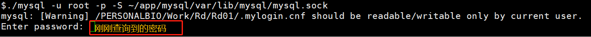

# LINUX端 安装 MySQL， 并通过Navicat 远程连接
- 适合入门安装
- 2021.12.17

## 1. LINUX端 安装 MySQL

- 场景：本人项目需要，需要建立一个部门内部的数据库，然而，查询到服务器已经有安装mysql，且个人账号均无root权限，也没有办法将已安装的mysql供个人使用，于是只能在个人账号目录下安装。

**难点**：

- 1. 以前对mysql不熟悉，不懂得mysql存在很多依赖
- 2. 服务器root账号安装的mysql会与个人账号安装时存在冲突
- 3. 无root权限，很多操作无法进行，更不可能删除已安装的mysql

### 基于rpm bundle 的 mysql 安装

>常见的安装方式有两种：源码安装 和 rpm 安装包安装
>源码安装：mysql-\*\*-tar.gz， 
>安装包安装:  mysql-\*.rpm bundle.gz,  mysql-\*.rpm.gz

- 本文最近尝试了各种方式，最终只有安装包安装没有冲突，且正常启动

#### 1.1 下载安装包并上传到服务器
本文的pkg文件夹下 有 mysql-5.7.25-1.el6.x86_64.rpm-bundle.tar
也可以下载其他版本。

打开Xshell, 连接到服务器，将安装包上传到指定目录下，本文放在 ~/app/mysql/

#### 1.2 解压安装包文件：

```shell
cd ~/app/mysql
tar -xvf mysql-5.7.25-1.el6.x86_64.rpm-bundle.tar
```

会得到以下9个安装包：


我们需要安装的只有5个（也有人说，只需要安装client 和 server即可，感兴趣的可以试一下）

#### 1.3 rpm安装 

一定要使用`rpm2cpio \*.rpm | cpio -idvm` 命令，才可以在`~/app/mysql/`下创建 `./var, ./usr, ./etc` 等文件夹，用于mysql配置文件的存放与查询。

```shell
cd ~/app/mysql
rpm2cpio mysql-community-common-5.7.25-1.el6.x86_64.rpm | cpio -idvm
rpm2cpio mysql-community-libs-5.7.25-1.el6.x86_64.rpm | cpio -idvm
rpm2cpio mysql-community-client-5.7.25-1.el6.x86_64.rpm | cpio -idvm
rpm2cpio mysql-community-server-5.7.25-1.el6.x86_64.rpm | cpio -idvm
rpm2cpio mysql-community-devel-5.7.25-1.el6.x86_64.rpm | cpio -idvm
```

```shell
# 将不需要的安装包放在pkg文件夹下保存
mkdir pkg
mv myaql-* pkg
# 查看rpm安装后的文件
cd ~/app/mysql
ll
# 会发现已经多了3个文件夹 var/ usr/ etc
```


```shell
# 创建配置需要的其他文件夹
mkdir ~/app/mysql/var/log
mkdir ~/app/mysql/var/lib/data
```

#### 1.4 **修改配置文件my.cnf**

```shell
vi ~/app/mysql/etc/my.cnf
```

添加或修改后如下：

- 注意： 需要将`~/app/mysql`  全部替换成你自己的绝对路径，这里用相对路径替代展示

```shell
//my.cnf
# For advice on how to change settings please see
# http://dev.mysql.com/doc/refman/5.7/en/server-configuration-defaults.html
[client]
port=3336   # 默认 3306 端口
socket=~/app/mysql/var/lib/mysql/mysql.sock

[mysqld]
#
# Remove leading # and set to the amount of RAM for the most important data
# cache in MySQL. Start at 70% of total RAM for dedicated server, else 10%.
# innodb_buffer_pool_size = 128M
#
# Remove leading # to turn on a very important data integrity option: logging
# changes to the binary log between backups.
# log_bin
#
# Remove leading # to set options mainly useful for reporting servers.
# The server defaults are faster for transactions and fast SELECTs.
# Adjust sizes as needed, experiment to find the optimal values.
# join_buffer_size = 128M
# sort_buffer_size = 2M
# read_rnd_buffer_size = 2M
port=3336
datadir=~/app/mysql/var/lib/mysql
socket=~/app/mysql/var/lib/mysql/mysql.sock

# Disabling symbolic-links is recommended to prevent assorted security risks
symbolic-links=0

log-error=~/app/mysql/var/log/mysqld.log
pid-file=~/app/mysql/var/run/mysqld/mysqld.pid

basedir=~/app/mysql/usr
secure-file-priv=~/app/mysql/var/lib/mysql-files

#字符集设置
character-set-server=utf8
init_connect='SET NAMES utf8’

#大小写不敏感
lower_case_table_names=1

sql-mode=STRICT_TRANS_TABLES,ERROR_FOR_DIVISION_BY_ZERO,NO_AUTO_CREATE_USER,NO_ENGINE_SUBSTITUTION
log-bin-trust-function-creators=1
```

#### 1.5 初始化mysql数据库

```shell
cd ~/app/mysql/usr/sbin
./mysqld --defaults-file=~/app/mysql/etc/my.cnf --initialize
```
#### 1.6 启动mysql
```shell
cd ~/app/mysql/usr/sbin
./mysqld --defaults-file=~/app/mysql/etc/my.cnf &
```
####  查看端口

```shell
netstat -nl | grep 3336   # 本人设的端口号是3336，其他人可自行修改
```


#### 1.7 获取初始密码

````shell
grep password ~/app/mysql/var/log/mysqld.log
````

$grep password ~/app/mysql/var/log/mysqld.log
2021-12-16T05:01:11.983451Z 1 [Note] A temporary password is generated for root@localhost: **9PIHmmj0pc.5**

#### 1.8 **登录root**

```shell
cd ~/app/mysql/usr/bin
# 这里一定要指定sock文件路径 -S 
./mysql -u root -p -S ~/app/mysql/var/lib/mysql/mysql.sock 
```



- 在这里，初始密码是上面查到的 -- **9PIHmmj0pc.5**


#### 1.9 修改root 账号的密码

```shell
ALTER USER 'root'@'localhost' IDENTIFIED BY 'psnb';
```

```shell
mysql> ALTER USER 'root'@'localhost' IDENTIFIED BY 'psnb';
Query OK, 0 rows affected (0.01 sec)
```
- 下次登录的密码就成了 **psnb**


#### 1.10 开通访问权限
`grant all privileges on *.* to 'root'@'%' identified by 'psnb';`

```shell
mysql> grant all privileges on *.* to 'root'@'%' identified by 'psnb';
Query OK, 0 rows affected, 1 warning (0.00 sec)
```
#### 刷新权限
`flush privileges;`

```shell
mysql> flush privileges;
Query OK, 0 rows affected (0.10 sec)
```

#### 1.11  退出mysql
```shell
mysql>quit
Bye
```
- 一般在服务器上的mysql安装就到此为止了，是不需要关闭服务的
#### 1.12  关闭mysql服务
```shell
cd ~/app/mysql/usr/bin
./mysqladmin -u root -p shutdown -S ~/app/mysql/var/lib/mysql/mysql.sock
```

```shell
mysqladmin: [Warning] /PERSONALBIO/Work/Rd/Rd01/.mylogin.cnf should be readable/writable only by current user.
Enter password: 
[1]+  Done                    ./mysqld --defaults-file=~/software/mysql/etc/my.cnf  (wd: ~/software/mysql/usr/sbin)
(wd now: ~/software/mysql/usr/bin)
```
## 2. Windows端 安装 Navicat 
- Navicat for MySQL 的安装就非常简单了，自行下载安装包，一步一步安装就好了，本人是全部默认安装的。

#### 2.1 Navicat 远程连接mysql


- 主机名或IP地址： Xshell 连接的服务器的IP

- 端口： mysql的端口，前面设置的是3336

- 用户名：mysql 的用户名，这里是root用户，也可以是非root用户

- 密码：mysql 的用户名对应的密码

  


- 连接测试成功后，点“确定”，保存即可，下次登录Navicat 双击这个连接，既可以登录远程的mysql


# 添加新用户 - 2022.1.6


1. root用户登录数据库
```
grant all privileges on crc.* to 'Rd2crc'@'localhost' identified by 'crc'  with grant option;
grant all privileges on crc.* to 'Rd2crc'@'%' identified by 'crc'  with grant option;
flush privileges;
```

2. 删除用户
```
drop user 'r&d2crc'@'%';
drop user 'r&d2crc'@'localhost';
flush privileges;

drop user 'rd2crc'@'%';
drop user 'rd2crc'@'localhost';
flush privileges;
```

3. Navicate 客户端 给 `rd2crc`用户赋予`super`权限


## 3. Reference

1.rpm package,rpm bundle和Compressed TAR Archive：https://blog.51cto.com/u_1306733/1921839

2.非root用户安装mysql: https://blog.csdn.net/weixin_37998428/article/details/111937822

3.mysql 中创建新的用户后成功登录后，使用mysql时出现 ERROR 1184 (08S01): 解决方案： https://zhuanlan.zhihu.com/p/30277196